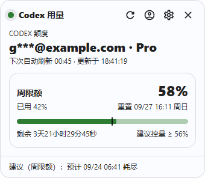
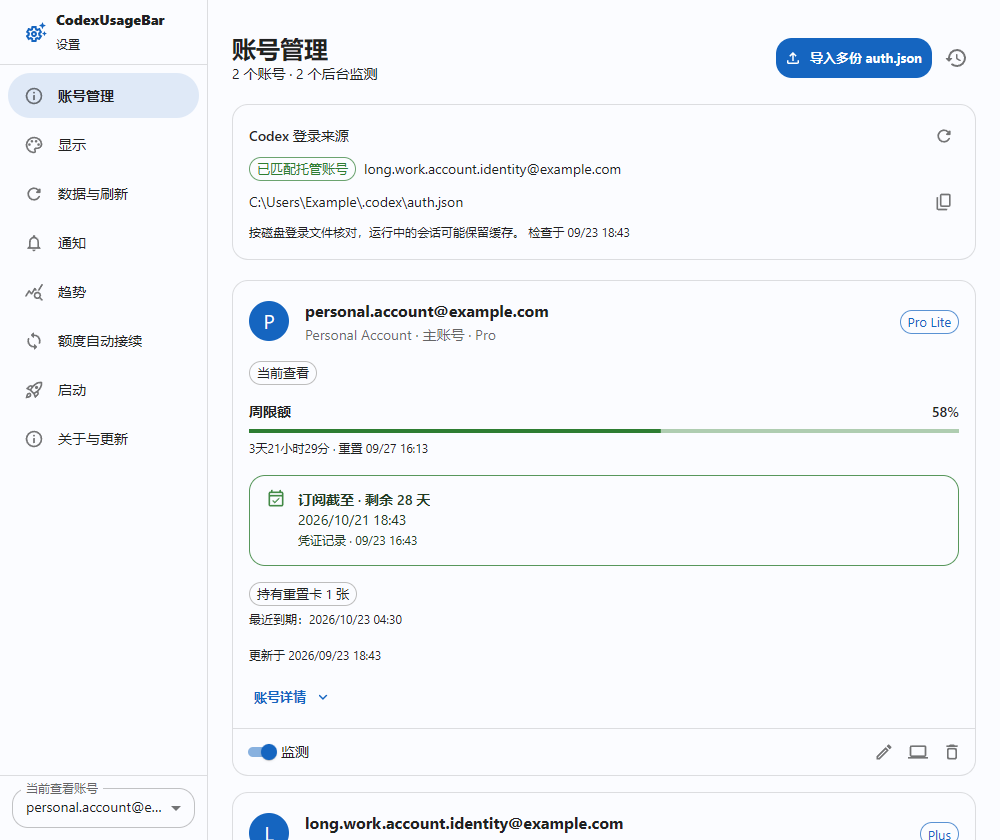
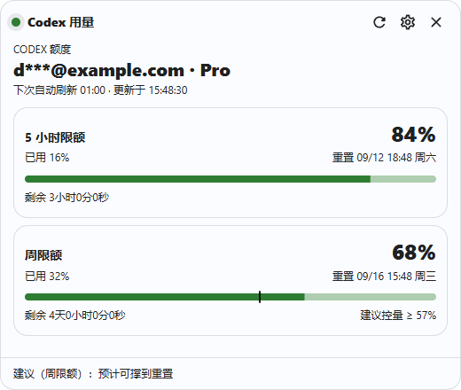
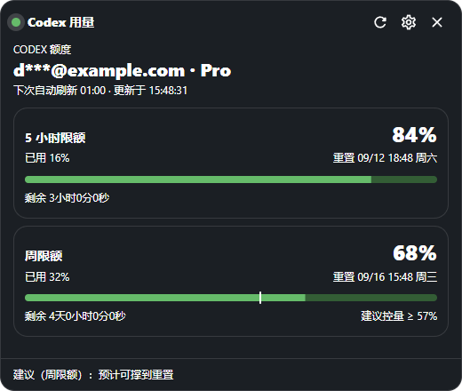
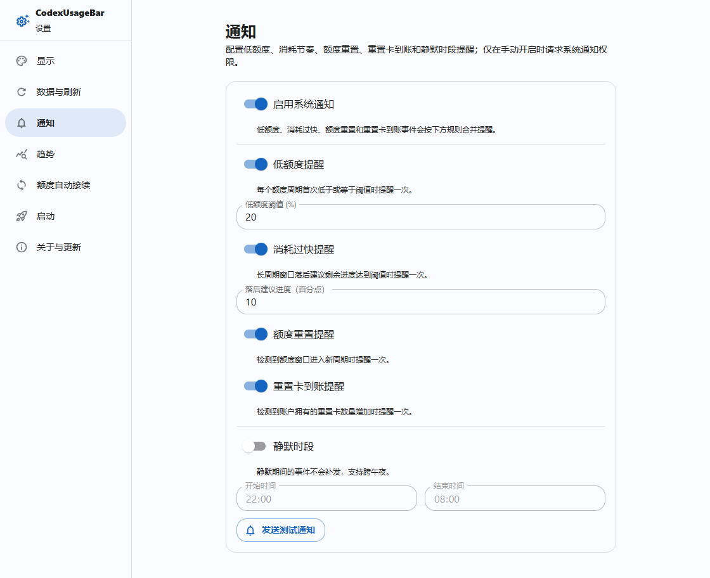
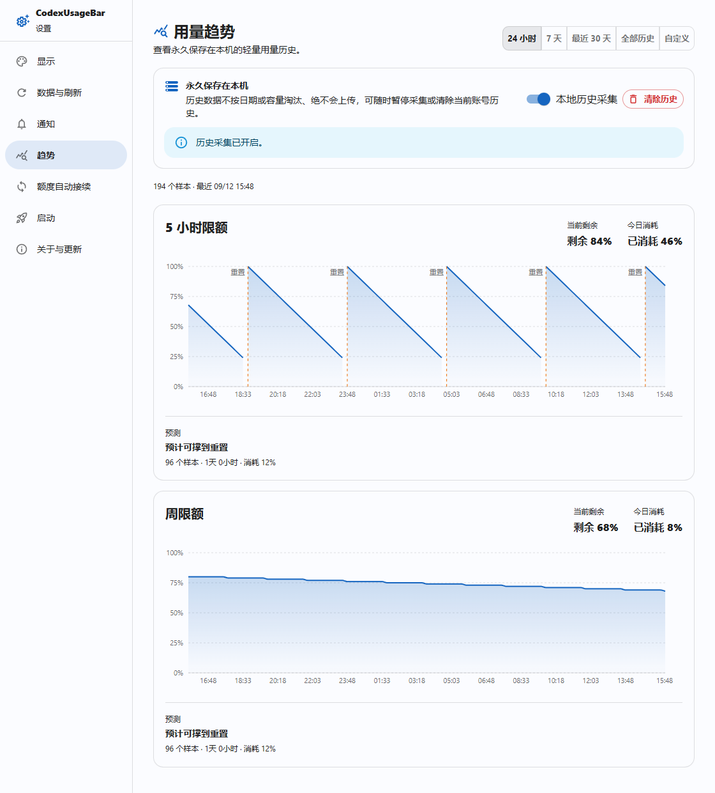
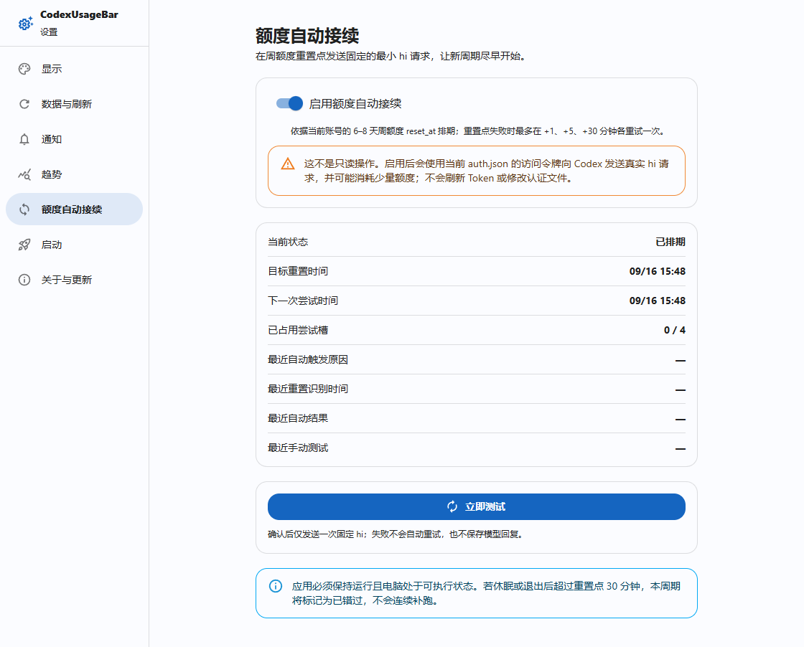
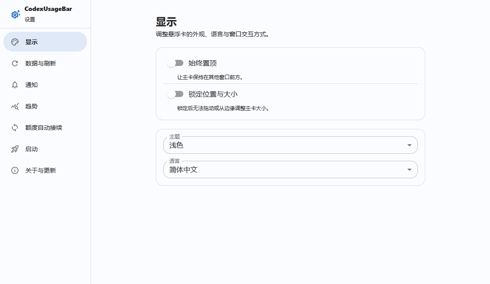
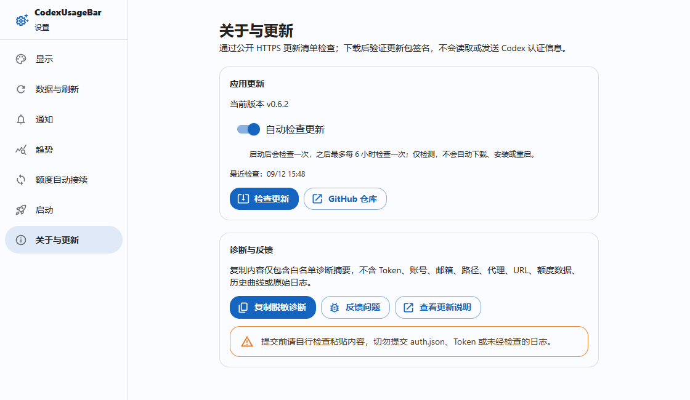

<div align="center">

# CodexUsageBar

**把 Codex 剩余额度、重置提醒和用量趋势放到桌面上。**

适用于 Windows 与 macOS 的轻量悬浮卡片，支持额度自动接续。

[下载最新版本](https://github.com/creamtea47/codex-usage-bar/releases/latest) · [核心功能](#核心功能) · [截图](#截图) · [详细指南](docs/guide-zh.md)

[](https://github.com/creamtea47/codex-usage-bar/actions/workflows/build.yml)
[](https://github.com/creamtea47/codex-usage-bar/releases/latest)
[](https://github.com/creamtea47/codex-usage-bar/releases)

[English](README.md) | 简体中文



</div>

## 核心功能

| 功能 | 能帮你做什么 |
| --- | --- |
| **桌面额度卡片** | 查看每个额度窗口的剩余百分比、重置时间和倒计时；支持定时刷新、置顶、拖动、大小锁定和关闭到托盘。 |
| **多账号管理** | 批量导入托管凭证、独立后台监测、辨认 Codex 登录文件账号，从标题栏或设置左下角切换查看。 |
| **范围与周期明细** | 点选图表两点统计跨重置消耗，按周期汇总并展开留存采样。 |
| **重置与到账提醒** | 额度进入新周期或重置卡数量增加时发送系统通知，也支持低额度、消耗过快提醒及跨午夜静默时段。 |
| **额度趋势采集** | 按剩余额度百分比记录历史，查看 24 小时、7 天、30 天、全部历史或自定义日期的曲线、今日消耗和本地预测。 |
| **额度自动接续** | 开启后，在周额度重置时自动发送最小请求，帮助不常使用时也及时启动下一周期。可查看排期、触发原因和执行结果。 |
| **个性化与更新** | 简体中文 / English、浅色 / 深色 / 跟随系统、开机启动；发现新版本后提示，由你确认下载和安装。 |

## 快速开始

1. 从 [Releases](https://github.com/creamtea47/codex-usage-bar/releases/latest) 下载对应安装包。

   | 设备 | 安装包 |
   | --- | --- |
   | Windows x64 | `CodexUsageBar-x64-setup.exe` |
   | Windows ARM64 | `CodexUsageBar-arm64-setup.exe` |
   | Intel Mac（macOS 11+） | `CodexUsageBar-macos-x64.dmg` |
   | Apple silicon Mac（macOS 11+） | `CodexUsageBar-macos-arm64.dmg` |

2. 在本机登录 Codex，然后启动 CodexUsageBar。Windows 安装器通常无需管理员权限；macOS 打开 DMG 后将应用拖到“应用程序”。
3. 首次启动自动读取额度，默认每分钟刷新一次。在卡片右上角打开设置，按需开启提醒与自动接续。

> macOS 安装包尚未经过 Apple 公证。首次启动若被拦截，可在“系统设置 → 隐私与安全性”中允许打开。v0.2.5 及更早版本需先手动安装新版，才能使用应用内更新。

### 提醒：额度重置和重置卡到账都不错过

在 **设置 → 通知** 打开总开关并授予系统权限，再选择规则：

- **额度重置**：检测到额度进入新周期时提醒。
- **重置卡到账**：同一账号的重置卡总数增加时提醒，需单独开启；只通知到账，不会自动使用重置卡。
- **低额度 / 消耗过快**：默认阈值分别为剩余 20% 和落后时间进度 10 个百分点，可自行调整。
- **静默时段**：支持如 22:00–08:00 的跨午夜范围，被静默的提醒不会稍后补发。

通知总开关默认关闭。首次成功采集和切换账号用于建立基线，不会把已有低额度或已有重置卡当作新事件提醒。检测依赖成功刷新，并非服务端实时推送。

### 趋势：按额度百分比了解消耗节奏

在 **设置 → 趋势** 查看曲线。本地采集默认开启，仅记录成功刷新的额度快照；记录的是**额度百分比**，不是 Token 数量或费用账单。

- 每个额度窗口独立绘图，重置处断开曲线，纵轴固定为 0–100%。
- 今日消耗从本地时间 00:00 累计，跨多个重置周期时可以超过 100%。
- 数据充足后显示能否撑到重置的本地估算；数据不足时显示“采集中”。预测不是官方承诺。
- 历史永久保存在本机，较旧数据会压缩采样；按匿名账号分区保存，切换回来可继续查看。
- 可暂停采集而保留历史，也可确认清除当前账号历史。应用关闭期间不采集，也不会凭空补齐历史。

### 多账号、范围与周期明细

“账号管理”支持批量导入、备注和后台监测，主卡与设置页可切换查看账号。图表点选两个点显示时长与累计消耗，各周期可展开留存采样。预测同时显示距耗尽时间与比重置提前多久。

每账号单独选择或手填接续模型，并查看最近自动/手动回复、HTTP状态和耗时。Codex凭证应用与恢复需先退出Codex，再手动重开；不会切换custom模型线路。

重置卡分别显示“持有”和“当前可用”数量，常驻最近到期时间，悬浮查看逐张有效期；使用条件以服务端返回为准。详情仅做只读查询，不兑换卡片。主窗底部保留短建议，距耗尽时长及比重置提前多久放在悬浮提示中。

### 自动接续：帮助下一周期及时开始

在 **设置 → 额度自动接续** 选择账号后开启并确认。应用分别关注已开启账号的周额度窗口（6–8 天），在检测到额度恢复或到达重置时间后，发送固定的最小 `hi` 请求。

- 默认关闭；开启后会产生真实模型请求，可能消耗少量额度。这是额度周期接续，不是付费订阅续费。
- 可重试的失败按重置事件的 +1、+5、+30 分钟时点重试；成功或发送结果不确定的请求不再自动补发。
- 需要电脑保持唤醒、网络可用且应用仍在运行（可留在托盘）。超过 30 分钟才恢复运行会错过该周期；不支持强制唤醒，因此无法保证所有情况下准时开始。
- “立即测试”需再次确认，只发送一次，不自动重试。可搭配“开机启动”和“关闭到托盘”使用。

## 截图

紧凑主窗与账号卡片截图对应 v0.7.0，其余设置页示例来自 v0.6.2。全部使用合成数据，不代表系统通知投递、原生窗口或自动接续已执行。见[截图记录](docs/screenshots.md)。



| 浅色额度卡片 | 深色额度卡片 |
| --- | --- |
|  |  |

### 通知规则与静默时段



### 额度趋势与今日消耗



### 自动接续排期



<details>
<summary>更多截图：显示设置、关于与更新</summary>





</details>

## 隐私与数据

凭据仅由本机 Rust 后端读取，前端不接触 Token 或认证文件。额度读取、趋势与通知默认只读；自动接续仅在明确开启或确认测试后发送请求，不会自动使用重置卡。托管账号支持 OAuth 令牌自动刷新；只有独立的“应用到 Codex”操作才替换 Codex 凭证，并保留 provider 配置。

认证文件依次从可执行文件旁、`%CODEX_HOME%/auth.json`、用户主目录下的 `.codex/auth.json` 查找。多份凭证可在“账号管理”导入；无法续期时重新登录并更新托管副本。

趋势、设置和脱敏接续状态保存在本机，运行日志保留 14 天。完整访问边界、文件路径、采样策略和诊断说明见[详细指南](docs/guide-zh.md)。

## 开发

技术栈：Tauri 2 · Rust · React 19 · TypeScript · Material UI · Recharts · Vite。

需要 Node.js 22.13+ 或 24+、pnpm 10、stable Rust；Windows 还需 MSVC 和 WebView2，macOS 还需 Xcode Command Line Tools。

```sh
pnpm install --frozen-lockfile
pnpm tauri dev
```

```sh
pnpm lint
pnpm test
pnpm build
cargo test --locked --manifest-path src-tauri/Cargo.toml
```

本地打包、签名、原生平台注意事项和 CI 发布流程见[开发与发布指南](docs/guide-zh.md)。

## 反馈与贡献

欢迎通过 [Issues](https://github.com/creamtea47/codex-usage-bar/issues) 反馈问题或建议，通过 Pull Request 贡献改进。报告问题时请提供系统、应用版本、复现步骤和截图；也可在“关于与更新”复制脱敏诊断，检查后自行粘贴。不要提交 `auth.json`、Token 或私人账户资料。
