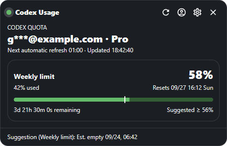
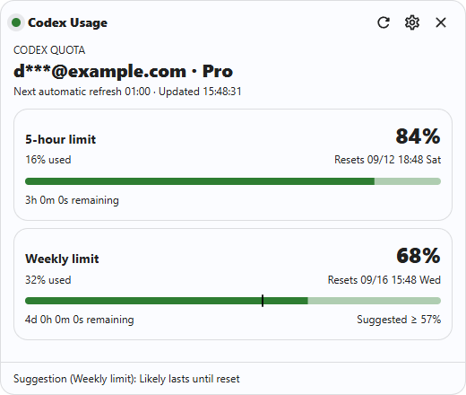
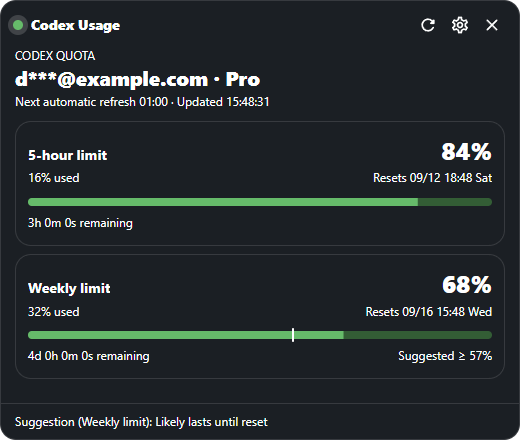
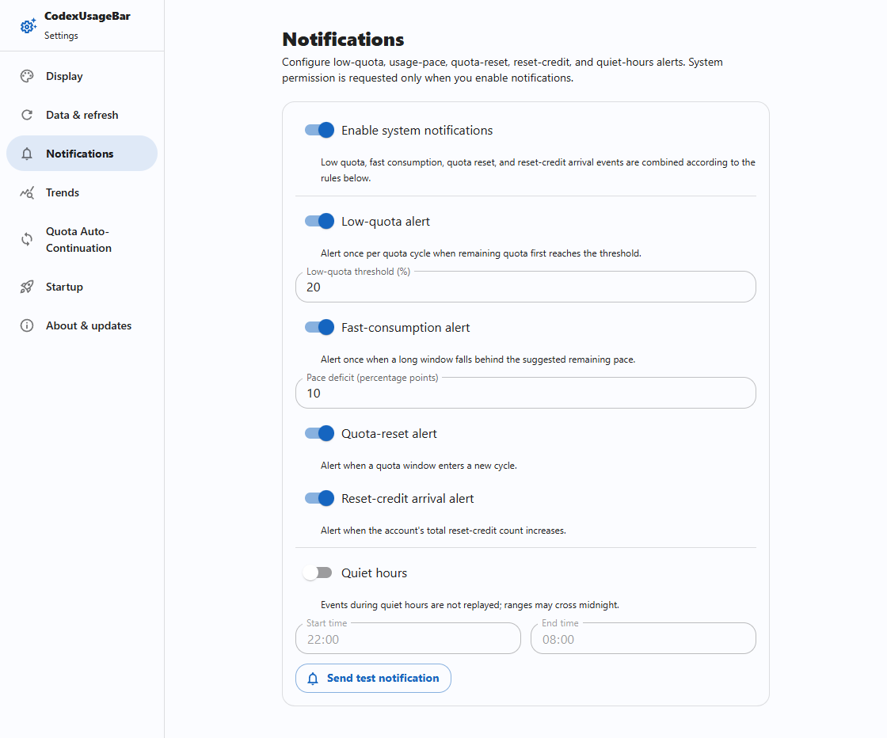
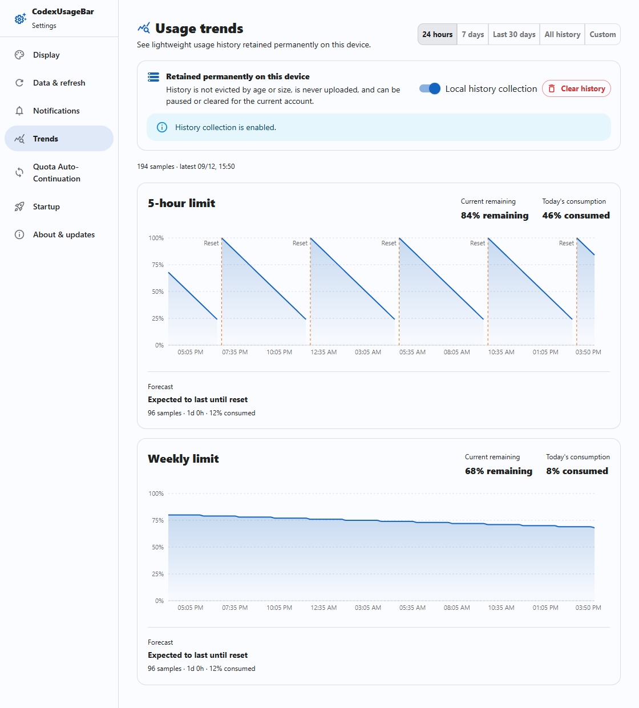
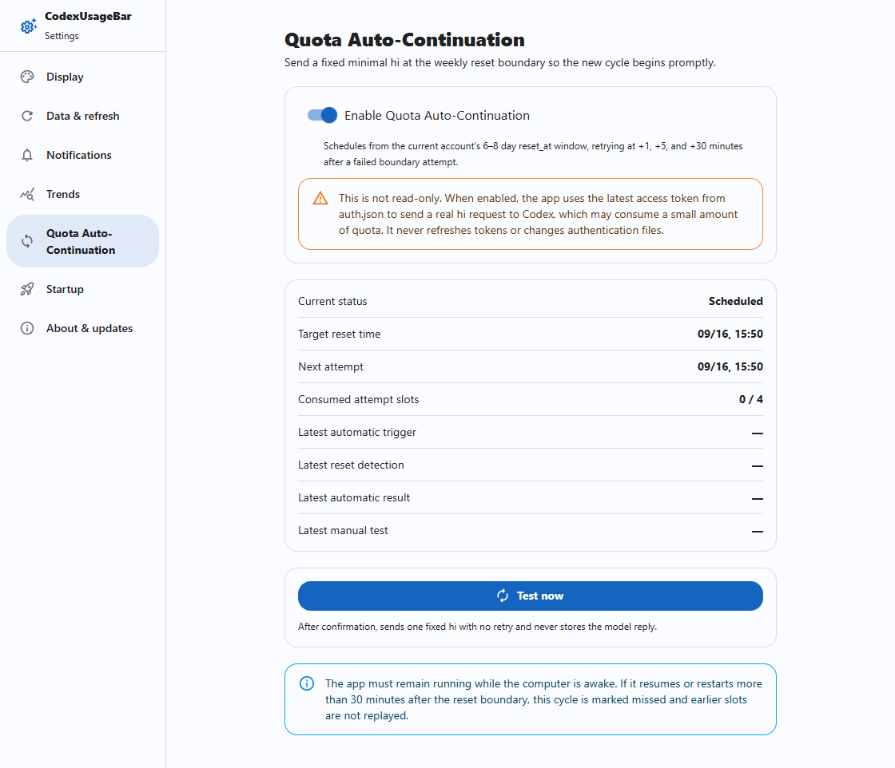
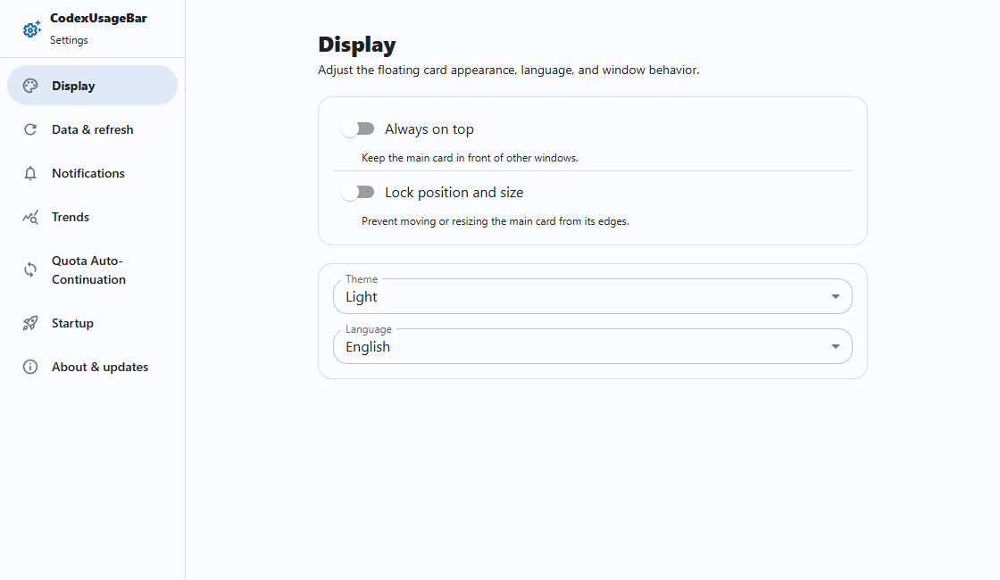
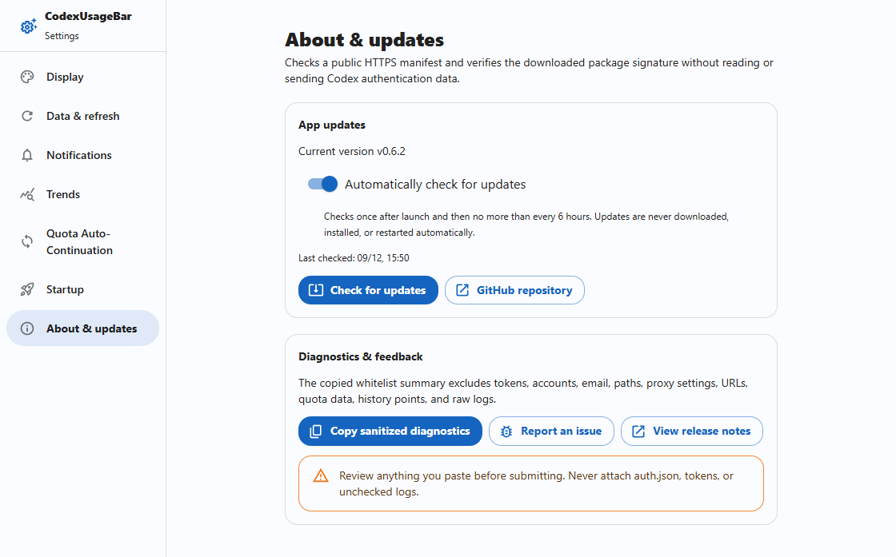

<div align="center">

# CodexUsageBar

**Keep Codex quota, reset alerts, and usage trends on your desktop.**

A compact floating card for Windows and macOS, with optional quota auto-continuation.

[Download](https://github.com/creamtea47/codex-usage-bar/releases/latest) · [Features](#features) · [Screenshots](#screenshots) · [Detailed guide](docs/guide.md)

[](https://github.com/creamtea47/codex-usage-bar/actions/workflows/build.yml)
[](https://github.com/creamtea47/codex-usage-bar/releases/latest)
[](https://github.com/creamtea47/codex-usage-bar/releases)

English | [简体中文](README-zh.md)



</div>

## Features

| Feature | What it does |
| --- | --- |
| **Desktop quota card** | See remaining percentages, reset times, and countdowns for every quota window. Includes scheduled refresh, always-on-top, dragging, size locking, and close-to-tray. |
| **Multiple accounts** | Import managed auth.json copies, monitor accounts independently, identify the Codex login file, and switch the viewed account from the title bar or Settings sidebar. |
| **Ranges and cycles** | Select two chart points to measure consumption across resets, then expand cycle rows into retained samples. |
| **Reset and credit alerts** | Get system notifications when quota resets or reset credits arrive, plus low-quota alerts, pace warnings, and quiet hours. |
| **Quota trend collection** | Track remaining quota percentages over 24 hours, 7 days, 30 days, all history, or custom dates, with today's consumption and local forecasts. |
| **Quota auto-continuation** | Optionally send a minimal request when weekly quota resets to help start the next cycle even during light usage. Inspect the schedule, trigger, and results. |
| **Personalization and updates** | English / Simplified Chinese, light / dark / system themes, autostart, and update notifications with user-confirmed installation. |

## Quick start

1. Download the matching installer from [Releases](https://github.com/creamtea47/codex-usage-bar/releases/latest).

   | Device | Asset |
   | --- | --- |
   | Windows x64 | `CodexUsageBar-x64-setup.exe` |
   | Windows ARM64 | `CodexUsageBar-arm64-setup.exe` |
   | Intel Mac (macOS 11+) | `CodexUsageBar-macos-x64.dmg` |
   | Apple silicon Mac (macOS 11+) | `CodexUsageBar-macos-arm64.dmg` |

2. Sign in to Codex on this computer, then launch CodexUsageBar. Windows normally installs without administrator privileges; on macOS, open the DMG and drag the app to Applications.
3. Quota loads at launch and refreshes every minute by default. Open Settings from the card's top-right corner to enable alerts and auto-continuation.

> macOS packages are not Apple-notarized. If the first launch is blocked, allow it in **System Settings → Privacy & Security**. Versions v0.2.5 and earlier need one manual upgrade before in-app updates become available.

### Alerts for resets and reset-credit arrivals

Open **Settings → Notifications**, enable notifications, grant OS permission, and choose your rules:

- **Quota reset:** notify when a quota window enters a new cycle.
- **Reset-credit arrival:** notify when the same account's total credit count increases. Enable this rule separately; it never automatically redeems credits.
- **Low quota / pace:** defaults are 20% remaining and a 10-percentage-point deficit against elapsed-time pace. Both are adjustable.
- **Quiet hours:** supports ranges crossing midnight, such as 22:00–08:00. Suppressed alerts are not replayed later.

The master switch defaults off. The first successful sample and account switches establish baselines instead of treating existing low quota or existing credits as new events. Detection relies on successful refreshes, not real-time server push.

### Trends measured in quota percentages

Open **Settings → Trends**. Local collection defaults on and records successful usage snapshots. It measures **quota percentages**, not token counts or billing costs.

- Each quota window has its own 0–100% chart, with breaks at cycle resets.
- Today's consumption accumulates from local midnight and can exceed 100% across multiple cycles.
- With enough samples, local forecasts estimate whether quota will last until reset. Otherwise they show **Collecting**. Forecasts are not official guarantees.
- History stays on this computer permanently, with older samples compacted. Anonymous account partitions restore the matching history when you switch back.
- Pause collection while keeping existing history, or confirm deletion of the current account's history. The app cannot collect while closed or reconstruct missing history.

### Auto-continuation for the next quota cycle

Open **Settings → Quota Auto-Continuation**, select an account, enable it, and confirm. For each enabled account, the app watches its weekly window (6–8 days) and sends a fixed minimal `hi` request after detecting quota recovery or reaching the reset deadline.

- Defaults off. Enabling it sends real model requests that may consume a small amount of quota. It continues quota cycles; it does not renew a paid subscription.
- Retryable failures use slots at +1, +5, and +30 minutes from the reset event. Successful or uncertain-delivery requests are not automatically sent again.
- The computer must be awake, online, and running the app (the tray is fine). Resuming more than 30 minutes late misses the cycle. There is no forced wake, so timely continuation cannot be guaranteed in every situation.
- **Test now** requires a second confirmation and sends once without retries. Autostart and close-to-tray can help keep the app available.

## Screenshots

The compact card and account screenshots show v0.7.0; the additional settings illustrations below are from v0.6.2. All use synthetic example data and do not demonstrate native windows, notification delivery, or completed continuation requests. See the [capture notes](docs/screenshots.md).


| Light quota card | Dark quota card |
| --- | --- |
|  |  |

### Notification rules and quiet hours



### Quota trends and today's consumption



### Auto-continuation schedule



<details>
<summary>More screenshots: display settings and updates</summary>





</details>

## Accounts and detailed usage

Manage multiple auth.json copies with per-account monitoring and a shared display selector. Select two chart points for interval consumption, expand each reset cycle into retained samples, and see estimated exhaustion relative to reset. Each account selects its continuation model and retains the latest automatic and manual response. Applying/restoring Codex credentials requires Codex to be closed and preserves custom provider routing.

Reset credits show held and currently usable counts separately. The nearest expiry stays visible, with each credit's expiry in the tooltip; eligibility comes from the service. The app only reads credit details and never redeems credits. Main-card forecasts stay short, with time-to-exhaustion and time-before-reset in the tooltip.

## Privacy and local data

Only the local Rust backend reads credentials; the frontend never receives tokens or authentication files. Quota reads, trends, and notifications are read-only. Auto-continuation sends requests only after opt-in or test confirmation, and never automatically consumes reset credits. Managed accounts support OAuth token refresh. The separate **Apply to Codex** action replaces Codex credentials while preserving provider configuration.

Credentials are searched beside the executable, then in `%CODEX_HOME%/auth.json`, then in `.codex/auth.json` under your home directory. Import additional credentials in **Accounts**; sign in again and update the managed copy when refresh is unavailable.

History, settings, and sanitized continuation state remain local. Runtime logs are retained for 14 days. See the [detailed guide](docs/guide.md) for access boundaries, storage paths, sampling policies, and troubleshooting.

## Development

Built with Tauri 2 · Rust · React 19 · TypeScript · Material UI · Recharts · Vite.

Requires Node.js 22.13+ or 24+, pnpm 10, and stable Rust. Windows also needs MSVC and WebView2; macOS needs Xcode Command Line Tools.

```sh
pnpm install --frozen-lockfile
pnpm tauri dev
```

```sh
pnpm lint
pnpm test
pnpm build
cargo test --locked --manifest-path src-tauri/Cargo.toml
```

See the [development and release guide](docs/guide.md) for native packaging, signing, platform caveats, and CI releases.

## Feedback and contributions

Report bugs and suggestions through [Issues](https://github.com/creamtea47/codex-usage-bar/issues), or send a Pull Request. Include your OS, app version, reproduction steps, and screenshots. **About & updates** can copy a sanitized diagnostic summary for you to review and paste. Never submit `auth.json`, tokens, or private account details.
