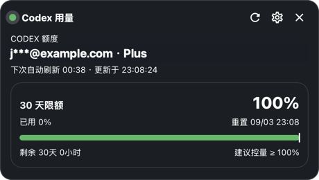
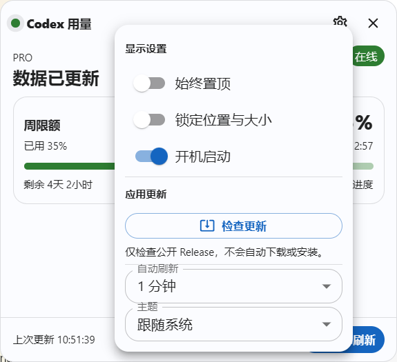

<div align="center">

# CodexUsageBar

**A privacy-first floating Codex usage card for Windows and macOS.**

Built with Tauri 2, Rust, React, TypeScript, Material UI, and Vite.

[Download](https://github.com/creamtea47/codex-usage-bar/releases/latest) · [Screenshots](#screenshots) · [Privacy](#privacy-and-read-only-boundary) · [Development](#development)

[](https://github.com/creamtea47/codex-usage-bar/actions/workflows/build.yml)
[](https://github.com/creamtea47/codex-usage-bar/releases/latest)
[](https://github.com/creamtea47/codex-usage-bar/releases)
[](https://github.com/creamtea47/codex-usage-bar/stargazers)

[简体中文](README-zh.md)

</div>

> CodexUsageBar reads usage data from a locally signed-in Codex session. It never uploads credentials, refreshes tokens, or operates reset cards.

## Screenshots

### Floating usage card (Windows example)



### Settings and manual update check



## Features

- Displays every quota window returned by the usage API, its remaining percentage, reset time, and local countdown.
- Refreshes at launch and on a configurable 1 / 3 / 5 / 10 / 30 minute interval; only the local countdown changes between requests.
- Borderless, draggable, resizable desktop card with system, light, and dark themes; supports always-on-top and position lock.
- Closes completely with its window—no tray-resident process. Autostart for the current account is optional.
- Provides a **manual update check** in Settings. It only checks the public releases of this repository; there is no background polling, auto-download, self-replacement, or restart.

## Install

1. Open [Releases](https://github.com/creamtea47/codex-usage-bar/releases/latest) and choose the matching asset:

   | Device | Asset | Install |
   | --- | --- | --- |
   | Windows x64 (most PCs) | `CodexUsageBar-x64-setup.exe` | Run the NSIS installer. It installs for the current user and normally needs no administrator privileges. |
   | Windows on ARM | `CodexUsageBar-arm64-setup.exe` | Run the NSIS installer. It installs for the current user and normally needs no administrator privileges. |
   | Intel Mac (macOS 11+) | `CodexUsageBar-macos-x64.dmg` | Open the DMG and drag the app to Applications. |
   | Apple silicon Mac (macOS 11+) | `CodexUsageBar-macos-arm64.dmg` | Open the DMG and drag the app to Applications. |

2. Sign in to Codex on this computer, then start **CodexUsageBar**.

The current macOS DMGs are ad-hoc signed and not Apple-notarized. If Gatekeeper blocks the first launch, allow the app in **System Settings → Privacy & Security**, or Control-click it and choose **Open**. Apple Developer ID signing and notarization require separately supplied Apple credentials.

The application uses a new application identifier and configuration directory. It is independent of the former `luodaoyi/codex-useage-win` repository and deliberately does not migrate or remove old settings or autostart entries.

### Windows legacy-upgrade note

The v0.2.1 “Unable to uninstall!” dialog is not a damaged download. The older Win32 package stored its install path under the `luodaoyi` publisher key, while v0.2.1 changed it to `creamtea47`; during an upgrade NSIS therefore passed an empty directory to the existing uninstaller. The v0.2.3 Windows package keeps the legacy key for this bridge and writes the new key after installation. This affects only Windows installer compatibility—not the Git repository, update endpoint, application identifier, or data directory.

If v0.2.1 is currently showing that error, exit the installer and download v0.2.3. Do not manually delete the registry entry or `auth.json`.

## Usage

The card tries to load usage data immediately after launch. Use **Refresh now** to retry; use the Settings button to adjust the theme, refresh interval, always-on-top, position lock, and autostart.

Choose **Check for updates** in Settings when you want to inspect a new version:

- When an update is available, the app opens this repository's Release download page. You choose whether to download and install it.
- When the current build is latest, the dialog shows both version values.
- A network failure or a missing public release never affects the quota data already on screen.

## Privacy and read-only boundary

Only the Rust backend reads local credentials during a request. React receives a filtered snapshot containing status, plan label, refresh time, a safe error message, and quota windows. It never receives `auth.json`, access tokens, email addresses, request headers, or raw API responses.

`auth.json` is searched in this order:

1. Next to the running application executable.
2. `%CODEX_HOME%\auth.json`.
3. Windows: `%USERPROFILE%\.codex\auth.json`; macOS: `~/.codex/auth.json`.

The app only reads `GET https://chatgpt.com/backend-api/wham/usage`, and it:

- Does not refresh OAuth tokens or write to `auth.json`.
- Does not query or consume reset cards and never begins an OAuth flow.
- Does not install frontend filesystem or HTTP permissions; sensitive I/O stays in Rust.
- Checks updates only against the public GitHub Release metadata for `creamtea47/codex-usage-bar`, without sending Codex credentials.

If credentials are missing, expired, or rejected, the last successful snapshot remains visible as stale. Sign in to Codex again, then choose **Refresh now**.

## Architecture

| Layer | Technology | Responsibility |
| --- | --- | --- |
| Desktop UI | React + TypeScript + Material UI + Vite | Chinese usage card, themes, settings popover, drag and resize interactions |
| Native boundary | Tauri 2 commands and capabilities | Narrow IPC and scoped window / release-link permissions |
| Data and persistence | Rust + Tokio + Reqwest + Serde | Read-only credentials, request de-duplication, cached snapshots, settings, autostart, redacted logs |

The complete frontend IPC surface is `get_dashboard`, `refresh_dashboard`, `get_settings`, `save_settings`, `get_autostart`, `set_autostart`, and `check_update`. Credentials never cross the Rust boundary.

## Logs and troubleshooting

- Settings and window placement: `%APPDATA%\com.creamtea47.codexusagebar\settings.json` on Windows; `~/Library/Application Support/com.creamtea47.codexusagebar/settings.json` on macOS.
- Runtime logs: `%LOCALAPPDATA%\com.creamtea47.codexusagebar\logs\codex-usage-bar.log` on Windows; `~/Library/Logs/com.creamtea47.codexusagebar/codex-usage-bar.log` on macOS; retained for 14 days.
- Logs contain timestamps, operation results, HTTP status classes, and redacted errors only—never tokens, Authorization headers, or authentication-file contents.
- If usage cannot be loaded, first confirm that Codex is signed in, then choose **Refresh now**. Never paste credentials into an issue, screenshot, or log.
- Autostart from the legacy Win32 app is neither migrated nor removed. Disable its old `HKCU\Software\Microsoft\Windows\CurrentVersion\Run` entry after confirming the new app works, otherwise two widgets may start together.

## Development

Development requires Node.js 22+, pnpm 10, and stable Rust. Windows additionally needs the MSVC toolchain and WebView2 Runtime; macOS needs Xcode Command Line Tools. A global Tauri CLI is not required.

```powershell
pnpm install --frozen-lockfile
pnpm lint
pnpm test
cargo test --locked --manifest-path src-tauri/Cargo.toml
pnpm tauri dev
```

Build the native package for the current platform with:

```powershell
# Windows: NSIS installer
pnpm tauri build --bundles nsis

# macOS: DMG
pnpm tauri build --bundles dmg
```

Output is written below `src-tauri\target\release\bundle\nsis\` or `src-tauri/target/release/bundle/dmg/`.

## CI and releases

Pushes to `main` / `master` and pull requests run frontend lint/tests, Rust tests, and native packaging on Windows x64, Windows ARM64, Intel Mac, and Apple silicon Mac runners. A `v*` tag publishes these assets and their SHA-256 checksums:

- `CodexUsageBar-x64-setup.exe`
- `CodexUsageBar-arm64-setup.exe`
- `CodexUsageBar-macos-x64.dmg`
- `CodexUsageBar-macos-arm64.dmg`

Example maintainer release:

```powershell
git tag -a v0.2.3 -m "v0.2.3 发布 macOS 安装包"
git push origin master
git push origin v0.2.3
```

## Intentionally excluded

There are no silent automatic updates, automatic installer downloads, taskbar-docked mode, legacy layout migration, UI language switching, OAuth token refresh, or reset-card operations.
