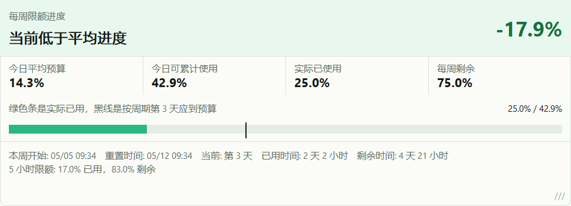

# CodexUsageBar

原生 `Win32/C++` 的 Codex 用量桌面挂件，面向 Windows。

## 项目看板

[](https://github.com/luodaoyi/codex-useage-win/actions/workflows/build.yml)
[](https://github.com/luodaoyi/codex-useage-win/releases/latest)
[](https://github.com/luodaoyi/codex-useage-win/releases/latest)
[](https://github.com/luodaoyi/codex-useage-win/releases)
[](https://github.com/luodaoyi/codex-useage-win/stargazers)

它会读取当前 Codex 账号的限额信息，在桌面上显示一个可拖动、可缩放的固定布局面板，用来观察：

- `5 小时限额` 已用/剩余
- `每周限额` 已用/剩余
- `当前周期理论应使用多少`
- `实际已经使用多少`
- `当前高于/低于平均进度`
- `距离重置还剩多久`

## 示例



## Star History

<a href="https://www.star-history.com/?repos=luodaoyi%2Fcodex-useage-win&type=date&legend=top-left">
 <picture>
   <source media="(prefers-color-scheme: dark)" srcset="https://api.star-history.com/chart?repos=luodaoyi/codex-useage-win&type=date&theme=dark&legend=top-left" />
   <source media="(prefers-color-scheme: light)" srcset="https://api.star-history.com/chart?repos=luodaoyi/codex-useage-win&type=date&legend=top-left" />
   
 </picture>
</a>

## 功能

- 原生 `Win32 + Direct2D + DirectWrite + WinHTTP`
- 无 `C#`、无 `WebView`
- 读取 `%USERPROFILE%\.codex\auth.json` 或 `%CODEX_HOME%\auth.json`
- 请求 `GET https://chatgpt.com/backend-api/wham/usage`
- 固定单布局：
  - 顶部状态标题和差值始终同一行
  - 四个指标始终等宽占满整行
  - 下方显示周进度条、预算标记线和底部信息
- 桌面浮层挂件，可拖动、可缩放
- 根据当前进度状态切换颜色
- 支持开机自启开关
- 支持 `Always on top` 置顶开关
- 支持 `Lock position` 固定位置开关

## 刷新策略

- 远程用量接口：每 `60` 秒刷新一次
- 本地倒计时：每 `1` 秒重绘一次
- 左键点击挂件：立即强制刷新
- 右键 `Refresh now`：立即强制刷新

## 使用方式

- 拖动挂件主体：移动位置
- 拖右边、下边、右下角：调整大小
- 右键菜单：
  - `Refresh now`
  - `Launch at startup`
  - `Always on top`
  - `Lock position`
  - `Reset widget position`
  - `Exit`

位置和尺寸会保存到：

- `%APPDATA%\CodexUsageBar\settings.ini`

开机自启使用当前用户注册表：

- `HKCU\Software\Microsoft\Windows\CurrentVersion\Run`

## 本地构建

### 直接构建

```cmd
build.cmd
```

输出文件：

- `CodexUsageBar.exe`

### 使用 CMake

```powershell
cmake -S . -B build -G "Visual Studio 17 2022" -A x64
cmake --build build --config Release
```

## GitHub Actions

仓库包含自动构建和自动发布工作流。

### 自动构建

- 平台：
  - `x64`
  - `ARM64`
- 触发方式：
  - 推送到 `main` / `master`
  - `pull_request`
  - `workflow_dispatch`

### 自动发布 Release

- 触发方式：
  - 推送版本标签，例如 `v0.1.0`
- 行为：
  - 自动构建 `x64` 和 `ARM64`
  - 自动创建 GitHub Release
  - 自动上传：
    - `CodexUsageBar-x64.exe`
    - `CodexUsageBar-ARM64.exe`

## 发布流程

```bash
git tag v0.1.0
git push origin master
git push origin v0.1.0
```

如果默认分支改成了 `main`，把上面的 `master` 换成 `main` 即可。

## 已知限制

- 当前只使用 `auth.json` 中现有的 `access_token`，还没做 `refresh_token` 自动续期
- 如果 OpenAI 后端接口字段变化，需要同步调整解析逻辑
- 当前是桌面浮层挂件，不是 Windows 7 时代的官方 Gadget 平台
