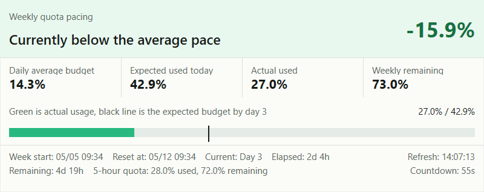
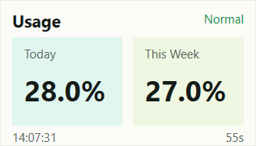

# CodexUsageBar

A native `Win32/C++` desktop widget for Windows that shows your Codex usage budget at a glance.

[中文说明](README-zh.md)

## Project Status

[](https://github.com/luodaoyi/codex-useage-win/actions/workflows/build.yml)
[](https://github.com/luodaoyi/codex-useage-win/releases/latest)
[](https://github.com/luodaoyi/codex-useage-win/releases/latest)
[](https://github.com/luodaoyi/codex-useage-win/releases)
[](https://github.com/luodaoyi/codex-useage-win/stargazers)

The widget reads usage limits from the current Codex account and displays them in a draggable, resizable desktop panel. It helps you monitor:

- `5-hour quota` used and remaining
- `Weekly quota` used and remaining
- `Expected usage` for the current point in the cycle
- `Actual usage`
- `Ahead of pace` or `behind pace`
- `Time until reset`
- `Last successful refresh`
- `Time until the next automatic refresh`

## Screenshots

### Standard Mode



### Simple Mode



## Features

- Native `Win32 + Direct2D + DirectWrite + WinHTTP`
- No `C#`, no `WebView`
- Reads `%USERPROFILE%\.codex\auth.json` or `%CODEX_HOME%\auth.json`
- Requests `GET https://chatgpt.com/backend-api/wham/usage`
- Two display modes:
  - Standard mode: hero status, four metrics, weekly pace bar, budget marker, footer details, refresh time, and countdown
  - Simple mode: compact `Today` and `This Week` cards with status text
- Desktop overlay widget with drag and resize support
- Dynamic coloring based on current pace
- Launch at startup toggle
- Always-on-top toggle
- Lock-position toggle
- UI language switch between English and Chinese

## Refresh Behavior

- Remote usage API refresh: every `60` seconds
- Local countdown repaint: every `1` second
- Left click on the widget: force refresh immediately
- Bottom-right area shows:
  - last successful refresh time
  - countdown to the next automatic refresh
- Right-click menu `Refresh now`: force refresh immediately

## Usage

- Drag the widget body to move it
- Drag the right edge, bottom edge, or bottom-right corner to resize it
- Right-click menu:
  - `Refresh now`
  - `Launch at startup`
  - `Always on top`
  - `Lock position`
  - `Simple mode`
  - `Language`
  - `Reset widget position`
  - `Exit`

Position and size are stored in:

- `%APPDATA%\CodexUsageBar\settings.ini`

Startup registration uses the current user registry key:

- `HKCU\Software\Microsoft\Windows\CurrentVersion\Run`

## Build Locally

### Direct Build

```cmd
build.cmd
```

Output:

- `CodexUsageBar.exe`

### Build with CMake

```powershell
cmake -S . -B build -G "Visual Studio 17 2022" -A x64
cmake --build build --config Release
```

## GitHub Actions

The repository includes automated build and release workflows.

### Build Workflow

- Platforms:
  - `x64`
  - `ARM64`
- Triggers:
  - push to `main` / `master`
  - `pull_request`
  - `workflow_dispatch`

### Release Workflow

- Trigger:
  - push a version tag such as `v0.1.0`
- Behavior:
  - build `x64` and `ARM64`
  - create a GitHub Release automatically
  - upload:
    - `CodexUsageBar-x64.exe`
    - `CodexUsageBar-ARM64.exe`

## Release Flow

```bash
git tag v0.1.0
git push origin master
git push origin v0.1.0
```

If the default branch is `main`, replace `master` with `main`.

## Known Limitations

- It currently relies on the existing `access_token` in `auth.json`; automatic refresh via `refresh_token` is not implemented
- If the OpenAI backend response changes, the parser must be updated accordingly
- This is a desktop overlay widget, not the legacy Windows Gadget platform

## Star History

<a href="https://www.star-history.com/?repos=luodaoyi%2Fcodex-useage-win&type=timeline&logscale=&legend=top-left">
 <picture>
   <source media="(prefers-color-scheme: dark)" srcset="https://api.star-history.com/chart?repos=luodaoyi/codex-useage-win&type=timeline&theme=dark&logscale&legend=top-left" />
   <source media="(prefers-color-scheme: light)" srcset="https://api.star-history.com/chart?repos=luodaoyi/codex-useage-win&type=timeline&logscale&legend=top-left" />
   
 </picture>
</a>
